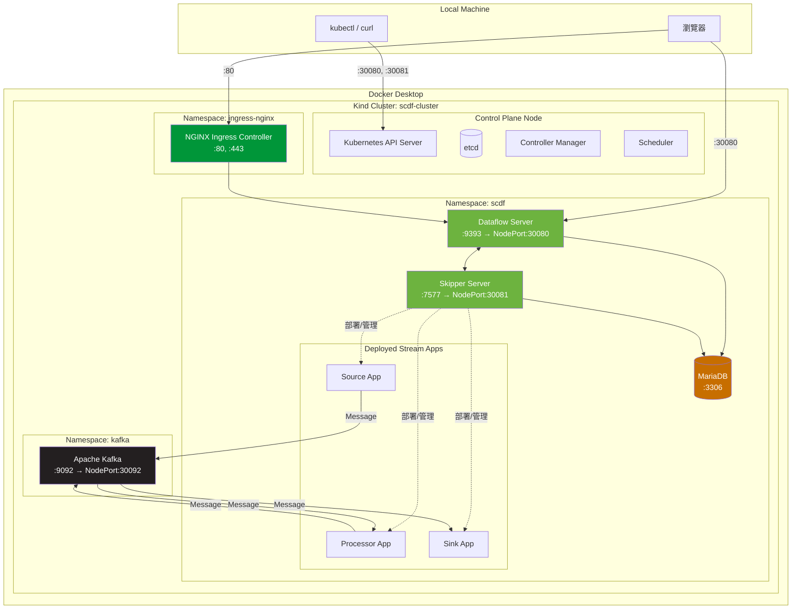
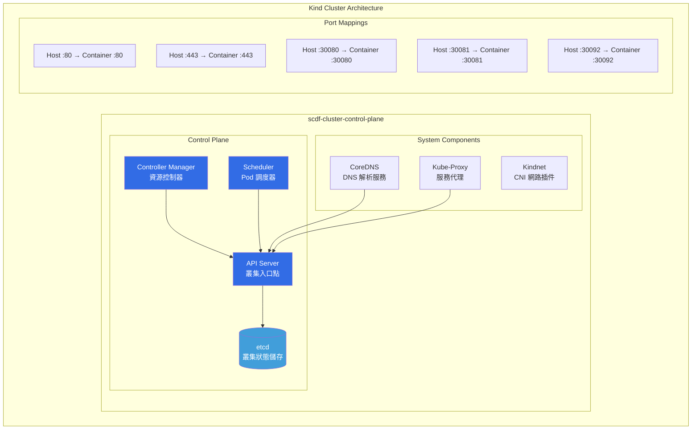
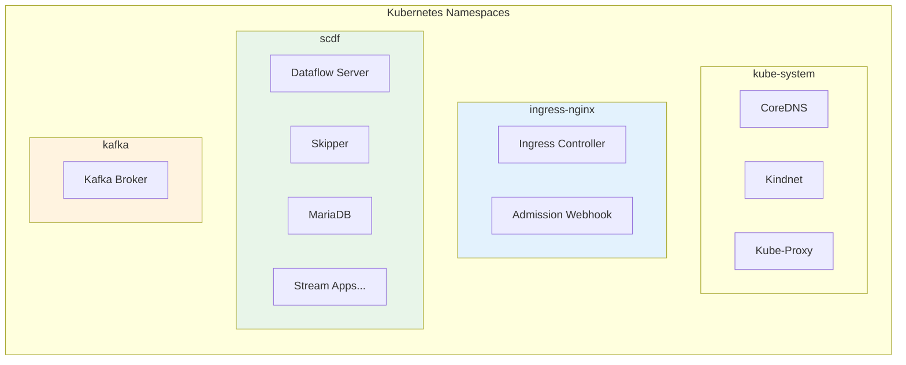
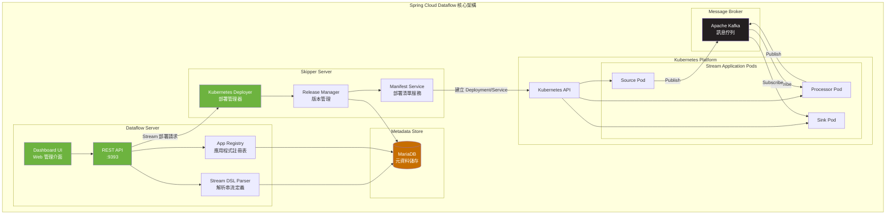
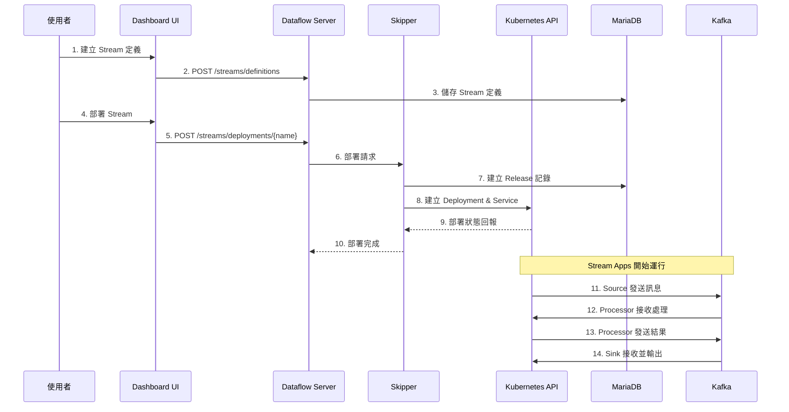
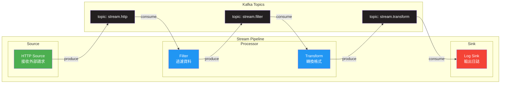
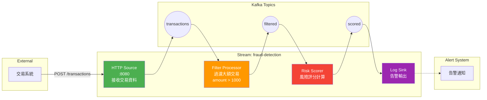
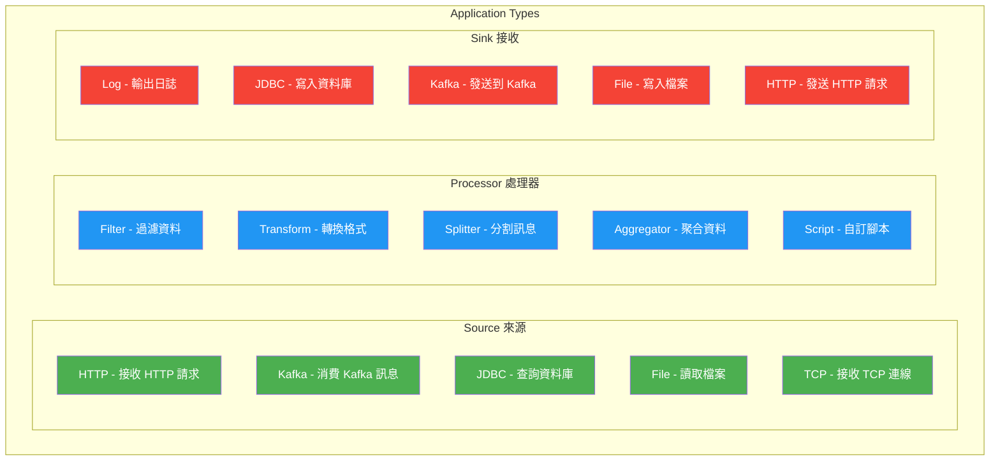

# Spring Cloud Dataflow Streaming PoC

在 Kind (Kubernetes in Docker) 上運行 Spring Cloud Dataflow 串流處理環境的 PoC 專案。

## 目錄

- [架構總覽](#架構總覽)
- [Kubernetes 叢集架構](#kubernetes-叢集架構)
- [Spring Cloud Dataflow 架構](#spring-cloud-dataflow-架構)
- [資料流架構](#資料流架構)
- [元件說明](#元件說明)
- [環境需求](#環境需求)
- [快速開始](#快速開始)
- [存取服務](#存取服務)
- [建立 Stream 範例](#建立-stream-範例)
- [故障排除](#故障排除)

---

## 架構總覽



---

## Kubernetes 叢集架構



### Namespace 配置



---

## Spring Cloud Dataflow 架構



### SCDF 元件互動流程



---

## 資料流架構

### Stream Pipeline 概念



### 即時交易風控範例架構



---

## 元件說明

### 核心元件

| 元件 | 說明 | Port | 用途 |
|------|------|------|------|
| **Dataflow Server** | SCDF 主服務 | 9393 (NodePort: 30080) | 提供 REST API 和 Dashboard UI，管理 Stream/Task 定義 |
| **Skipper Server** | 部署管理服務 | 7577 (NodePort: 30081) | 負責 Stream 應用程式的部署、升級和回滾 |
| **MariaDB** | 關聯式資料庫 | 3306 | 儲存 SCDF 元資料、Stream 定義、部署歷史 |
| **Apache Kafka** | 訊息佇列 | 9092 (NodePort: 30092) | Stream 應用程式之間的訊息傳遞 |
| **NGINX Ingress** | 入口控制器 | 80, 443 | 提供 HTTP/HTTPS 路由 |

### Stream 應用程式類型



---

## 環境需求

| 工具 | 版本要求 | 說明 |
|------|----------|------|
| Docker Desktop | 4.x+ | 容器運行環境，至少配置 8GB RAM, 4 CPU |
| Kind | v0.20+ | Kubernetes in Docker |
| kubectl | v1.28+ | Kubernetes CLI |
| Helm | v3.12+ | Kubernetes 套件管理 |

### 資源需求

| 元件 | CPU Request | Memory Request | CPU Limit | Memory Limit |
|------|-------------|----------------|-----------|--------------|
| Dataflow Server | 200m | 1Gi | 1000m | 1536Mi |
| Skipper | 200m | 1Gi | 1000m | 1536Mi |
| Kafka | 250m | 512Mi | 500m | 1Gi |
| MariaDB | 100m | 256Mi | 500m | 512Mi |
| Stream App (each) | 100m | 256Mi | 500m | 512Mi |

---

## 快速開始

### 1. 建立 Kind 叢集

```bash
kind create cluster --config kind-config.yaml
```

### 2. 建立 Namespaces

```bash
kubectl create namespace scdf
kubectl create namespace kafka
```

### 3. 部署 Kafka

```bash
kubectl apply -f kafka-cluster.yaml
kubectl wait --for=condition=ready pod -l app=kafka -n kafka --timeout=180s
```

### 4. 部署 MariaDB

```bash
kubectl apply -f mysql.yaml
kubectl wait --for=condition=ready pod -l app=mysql -n scdf --timeout=120s
```

### 5. 部署 Spring Cloud Dataflow

```bash
kubectl apply -f scdf.yaml

# 等待 Skipper 就緒（約 3-5 分鐘）
kubectl wait --for=condition=ready pod -l app=skipper -n scdf --timeout=300s

# 等待 Dataflow Server 就緒（約 3-5 分鐘）
kubectl wait --for=condition=ready pod -l app=dataflow-server -n scdf --timeout=300s
```

### 6. 安裝 Ingress Controller（選用）

```bash
kubectl apply -f https://raw.githubusercontent.com/kubernetes/ingress-nginx/main/deploy/static/provider/kind/deploy.yaml
kubectl wait --namespace ingress-nginx --for=condition=ready pod --selector=app.kubernetes.io/component=controller --timeout=180s
kubectl apply -f ingress.yaml
```

---

## 存取服務

| 服務 | URL | 說明 |
|------|-----|------|
| SCDF Dashboard | http://localhost:30080/dashboard | Web 管理介面 |
| Dataflow REST API | http://localhost:30080 | REST API 端點 |
| Skipper | http://localhost:30081 | Skipper 管理 API |
| Kafka (外部) | localhost:30092 | Kafka broker |

---

## 建立 Stream 範例

### 方法一：使用 Dashboard UI

1. 開啟 http://localhost:30080/dashboard
2. 點擊 **Apps** → **Add Application(s)**
3. 選擇 **Import application starters from dataflow.spring.io**
4. 選擇 **Stream application starters for Kafka/Maven**
5. 點擊 **Import**
6. 進入 **Streams** → **Create Stream**
7. 輸入 Stream DSL：`http --port=8080 | log`
8. 點擊 **Create Stream** 並命名為 `simple-log`
9. 點擊 **Deploy**

### 方法二：使用 REST API

```bash
# 匯入預建應用程式
curl -X POST "http://localhost:30080/apps" \
  -d "uri=https://dataflow.spring.io/kafka-maven-latest"

# 建立 Stream 定義
curl -X POST "http://localhost:30080/streams/definitions" \
  -d "name=simple-log" \
  -d "definition=http --port=8080 | log"

# 部署 Stream
curl -X POST "http://localhost:30080/streams/deployments/simple-log"

# 檢查部署狀態
curl "http://localhost:30080/streams/definitions/simple-log"
```

### 測試 Stream

```bash
# 取得 HTTP Source Pod 並進行 port forward
HTTP_POD=$(kubectl get pods -n scdf -l spring-app-id=simple-log-http -o jsonpath='{.items[0].metadata.name}')
kubectl port-forward -n scdf $HTTP_POD 8080:8080 &

# 發送測試訊息
curl -X POST http://localhost:8080 \
  -H "Content-Type: application/json" \
  -d '{"message": "Hello SCDF!"}'

# 查看 Log Sink 輸出
LOG_POD=$(kubectl get pods -n scdf -l spring-app-id=simple-log-log -o jsonpath='{.items[0].metadata.name}')
kubectl logs -f -n scdf $LOG_POD
```

---

## 檔案說明

| 檔案 | 說明 |
|------|------|
| `kind-config.yaml` | Kind 叢集配置，定義 port mapping 和節點設定 |
| `kafka-cluster.yaml` | Apache Kafka 部署配置（KRaft 模式，無 Zookeeper） |
| `mysql.yaml` | MariaDB 資料庫部署配置 |
| `scdf.yaml` | Spring Cloud Dataflow Server 和 Skipper 完整配置 |
| `scdf-values.yaml` | SCDF Helm values 參考檔案 |
| `ingress.yaml` | NGINX Ingress 路由配置 |

---

## 故障排除

### 常見問題

#### Pod 無法啟動

```bash
# 檢查 Pod 狀態
kubectl get pods -n scdf
kubectl describe pod <pod-name> -n scdf

# 查看 Pod 日誌
kubectl logs <pod-name> -n scdf
kubectl logs <pod-name> -n scdf --previous  # 查看前一個容器的日誌
```

#### 資料庫連線問題

```bash
# 測試 MariaDB 連線
kubectl exec -it -n scdf $(kubectl get pods -n scdf -l app=mysql -o jsonpath='{.items[0].metadata.name}') \
  -- mariadb -u dataflow -pdataflow123 dataflow -e "SHOW TABLES;"
```

#### Kafka 連線問題

```bash
# 建立測試 Pod
kubectl run kafka-client --restart='Never' --image=apache/kafka:3.8.0 \
  --namespace=kafka --command -- sleep infinity

# 列出 Topics
kubectl exec -it kafka-client -n kafka -- \
  /opt/kafka/bin/kafka-topics.sh --list --bootstrap-server kafka:9092

# 刪除測試 Pod
kubectl delete pod kafka-client -n kafka
```

#### SCDF 健康檢查

```bash
# 檢查 Dataflow Server
curl http://localhost:30080/about

# 檢查 Skipper
curl http://localhost:30081/api/about

# 檢查已部署的 Streams
curl http://localhost:30080/streams/definitions
```

---

## 清理環境

```bash
# 刪除所有 Streams
curl -X DELETE "http://localhost:30080/streams/definitions/simple-log"

# 刪除 Kind 叢集
kind delete cluster --name scdf-cluster
```

---

## 參考資源

- [Spring Cloud Dataflow 官方文件](https://dataflow.spring.io/docs/)
- [Spring Cloud Dataflow Reference Guide](https://docs.spring.io/spring-cloud-dataflow/docs/current/reference/htmlsingle/)
- [Apache Kafka Documentation](https://kafka.apache.org/documentation/)
- [Kind - Kubernetes in Docker](https://kind.sigs.k8s.io/)
- [Stream Application Starters](https://cloud.spring.io/spring-cloud-stream-app-starters/)

---

> **建立日期**: 2026-01-30
> **環境版本**: SCDF 2.11.5 / Kafka 3.8.0 / Kind v0.27.0 / Kubernetes v1.32.2
